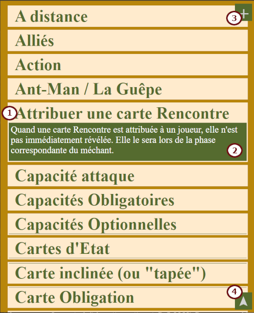
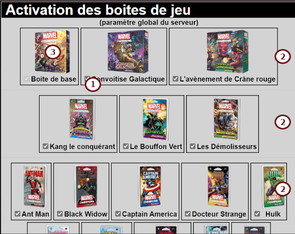
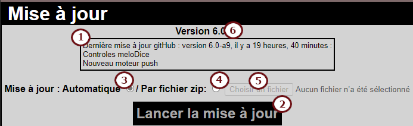

# Contenu de la documentation
### 1. [Installation de '*Remote Champions*'](https:#installation-de-remote-champions)
1a. [Prérequis serveur](https:#prérequis-serveur)  
1b. [Docker](https:#docker)  
1c. [Séquence d'installation](https:#séquence-dinstallation)  
1d. [Mise à jour de '*Remote Champions*'](https:#mise-à-jour-de-remote-champions)  
### 2. [Utilisation de '*Remote Champions*'](https:#utilisation-de-remote-champions)
2a. [Page de connexion](https:#page-de-connexion)  
2b. [Création d'une partie](https:#création-dune-nouvelle-partie)  
2c. [Présentation de la page de partie](https:#présentation-de-la-page-de-partie)  
2d. [Paramétrage initial de la partie](https:#paramétrage-initial-de-la-partie)  
2e. [Gestion du méchant](https:#gestion-du-méchant)  
2f. [Gestion du joueur](https:#gestion-du-joueur)  
2g. [Gestion des Manigances](https:#gestion-des-manigances)  
2h. [Aides de jeu](https:#aides-de-jeu)
### 3. [Administration du site](https:#administration-du-site)
3a. [Mot de passe administratif](https:#mot-de-passe-administratif)  
3b. [Activation des boites de jeu](https:#activation-des-boites-de-jeu)  
3c. [Liste des parties sur le serveur](https:#liste-des-parties-sur-le-serveur)  
3d. [Sauvegarde/REsturation](https:#sauvegarde--restauration)  
3e. [Mode public](https:#mode-public)  
3f. [Melodice](https:#melodice)  
3f. [Mise à jour](https:#mise-à-jour)  
### 4. [Accès par smartphone](https:#accès-par-smartphone)
### 5. [Foire aux questions](https:#foire-aux-questions)

---
# Installation de '*Remote Champions*'
## Prérequis serveur
Pour installer *Remote Champions* sur un serveur vous appartenant, il vous faudra un [serveur web prenant en charge PHP](https:#serveur-web-php).
#### Serveur Web PHP
En complément de l'installation du service PHP, celui-ci (le compte avec lequel le service fonctionne) doit avoir les **accès en écriture et suppression sur le répertoire racine de l'installation** et sur tous les fichiers/dossiers inclus. Ces autorisations sont nécessaires pour mener à bien les processus d'installation et de mise à jour.  
De plus, le moteur php doit permettre les lectures de fichiers distants (http get) pour que l'installation et la mise à jour puissent se dérouler sans problème.  
Fonctionnement testé avec succès sur les configurations/versions suivantes :
 - Apache 2.2
 - Apache 2.4
 - Nginx
 - PHP 7.2
 - PHP 7.4
 ## Docker
Si vous n'avez pas de serveur web/php mais que vous avez un moteur Docker à votre disposition, vous pouvez également vous contenter de récupérer le conteneur remotechampions en le cherchant (*fouyou/remotechampions*) sur docker Hub.  
Une fois votre conteneur démarré, accédez à votre site en http ou https (comme tous les mots de passe sont transmis en clair au serveur pour que leur empreinte soit comparée à celle stockée, nous vous recommandons fortement de passer par https, même si le certificat du conteneur est un certificat autosigné...).  
**Nota :** Ce conteneur est basé sur un moteur web Nginx et du PHP 7.4.  
**Nota2 :** Vous pourrez, par la suite si vous le souhaitez, mettre à jour votre installation vers une installation plus récente.  
## Séquence d'installation
1. Copiez tout le contenu (y compris le(s) sous-dossier(s)) du dossier **Setup** du présent dépôt vers le dossier choisi sur votre serveur pour héberger le site *Remote Champions*.
1. Vérifier que votre installation de PHP a les droits nécessaires pour écrire et supprimer des fichiers dans le dossier choisi et ses sous-dossiers.  
**Note :** Si vous utilisez le site pour jouer à distance avec des amis (but original de ce développement), il faudra bien sûr que le site web soit accessible de tous les joueurs sur Internet.
## Mise à jour de '*Remote Champions*'
Lorsque le site est installé, vous pouvez voir la dernière mise à jours disponible (ainsi que sa date de publication) dans la section "[mise à jour](https:#mise-à-jour)" de l'écran d'administration.  
Cliquez sur le bouton "*Lancer la mise à jour*" lorsque vous le souhaitez.
Les mises à jour peuvent inclure de nouvelles fonctionnalités, des corrections de bug ou des mises à jour de contenu (nouvelles extensions, nouveaux packs de scénarii ou de héros). Vous pouvez accèder à la description de toutes les mises à jour [dans le dépot gitHub](https:../../README.md#historique-des-changements).

---
# Utilisation de '*Remote Champions*'
**Préambule:** L'outil *Remote Champions* n'est en aucun cas prévu pour remplacer la possession des cartes par les joueurs : il  a pour seul objectif de fluidifier le déroulement des parties (particulièrement des parties jouées à distance, avec audio/visio conférence) en tenant à jour un maximum des éléments nécessaires au suivi de la partie et en les présentant aux différents joueurs.  
## Page de connexion
Utilisez votre navigateur Internet, depuis votre ordinateur ou depuis votre smartphone pour accéder à votre installation de *Remote Champions*. La page d'accueil se présente comme l'illustration suivante:  

- Si la partie qui vous intéresse a déjà été créée, vous pouvez simplement saisir **son mot-clef** dans le premier champ avant de cliquer sur "*OK*",
- En cliquant sur le bouton "**Créer**" (non disponible sur smartphone), vous basculez sur la page de [création d'une nouvelle partie](https:#Création-dune-nouvelle-partie) (à noter qu'un mot de passe peut être demandé si la fonction de serveur public a été activée dans l'écran d'administration décrit plus loin),
- En dehors des écrans d'administration et d'installation/mise à jour, en cliquant sur la barre d'administration (non disponible sur smartphone) vous serez dirigé vers l'écran d'administration, [décrit plus loin](https:#administration-du-site) (A noter, un mot de passe administratif sera nécessaire pour se connecter sur ces pages sensibles, le mot de passe par défaut après installation est **admin**),
- Dans tous les écrans du site, en cliquant sur le bouton d'Informations (non disponible sur smartphone), vous serez directement dirigé sur la présente aide d'utilisation,
- Dans tous les écrans du site, en cliquant sur le bouton de rapport de bug (non disponible sur smartphone), vous serez directement dirigé sur *gitHub* afin de saisir une description du problème que vous rencontrez (Un compte gratuit *gitHub* sera nécessaire. Merci pour vos retours!).
## Création d'une nouvelle partie
La page de création d'une nouvelle partie ressemblera à l'illustration ci-dessous:  
  
- Pour créer une nouvelle partie, vous pouvez choisir le nombre de joueurs (1 à 4) depuis le menu.  
- **À noter :** vous pouvez également créer une partie ayant pour seul objectif de suivre les information d'un méchant en cliquant sur la case "*Méchant seul*". Cela peut, par exemple, être utile pour créer plusieurs parties et suivre plusieurs méchants, dans une partie avec *Kang*.  
- Une clef d'accès par défaut est automatiquement affectée à la partie que vous allez créer. Si vous le souhaitez, vous pouvez modifier la valeur de cette clef proposée dans le champ "*Clef d'accès*" (A noter: les clefs d'accès doivent impérativement comporter 6 caractères et être uniques).  
- Une fois ces informations essentielles saisies, vous pouvez cliquer sur "*Créer*" pour lancer la création de la partie.
### Options
Vous pouvez (cela n'est pas une obligation, mais peut permettre de simplifier la sélection des manigances pendant la partie) également choisir les decks qui seront utilisés pendant votre partie.  
Pour ce faire, il vous suffit de cliquer sur la case à cocher en regard d'un deck pour le sélectionner ou le désélectionner avant de cliquer sur le bouton "*Créer*".  
 - Les decks pouvant être sélectionnés sont regroupés par boite de jeu/extensions/paquets pour les retrouver/(dé)selectionner plus facilement. Les boites disponibles sont celles déclarées comme telles dans l'[administration du site](https:#activation-des-boites-de-jeu).  
 - Vous pouvez (dé)sélectionner tous les decks en un clic pour plus de facilité.  
Après avoir créé votre nouvelle partie, vous serez dirigé vers la page de celle-ci (ou vers votre fiche de joueur si vous êtes sur smartphone).  

Si une erreur empêche la création de la partie, elle vous sera communiquée sur la même page, afin que vous puissiez retenter la création.
## Présentation de la page de partie
La page principale d'une partie qui vient d'être créée ressemble à l'illustration suivante:  
  
Cette page est divisée en différentes zones:  
La section joueur, qui représente l'état de chaque joueur (elle est détaillée [plus loin](https:#gestion-du-joueur)).  
La section méchant qui fournit les informations sur la situation actuelle du méchant de la partie (elle est détaillée [plus loin](https:#Gestion-du-mechant))  
L'indicateur du premier joueur. Le premier joueur est désigné au hasard parmi les joueurs de la partie lors de la sélection de la manigance principale. Il suffira ensuite de cliquer sur l'indicateur du premier joueur pour indiquer que c'est le tour du joueur suivant (l'indicateur se déplacera alors automatiquement en regard du joueur suivant).  
Un ensemble de compteurs annexes. A vous de voir si vous avez besoin d'autres compteurs que les principaux prévus : cela pourra servir, par exemple, pour suivre des éléments spécifiques à certaines missions...  
La section manigances (détaillée [plus loin](https:#Gestion-des-Manigances)).  
A tout moment, le **mot-clef d'accès** à la partie, à communiquer à tous les joueurs pour que ceux-ci puissent la rejoindre est rappelé en bas de page. (nota : Non disponible sur smartphone; En cliquant dessus, il est possible d'ouvrir l'[écran d'administration](https:#administration-du-site) décrit plus loin).  
A tout moment, pendant une partie, vous pouvez cliquer sur le bouton **"Aide"** afin d'ouvrir la fenêtre d'[aides de jeu](https:#aides-de-jeu) qui contient un rappel des mots-clef pour vous aider à vous rappeler des élements principaux et des termes pièges...  
## Paramétrage initial de la partie
  
1. Il est conseillé de commencer par attribuer les places aux joueurs:
  - Mettez-vous d'accord avec tous les joueurs (y compris distants) pour trouver une disposition ayant le plus de sens pour l'ensemble des joueurs de la partie.
  - Cliquez sur le nom de chaque joueur. Cela fait appraitre la fenêtre de changement de nom de joueur : saisissez le nouveau nom/surnom du joueur et validez.
  - Cliquez sur l'image de héros de chaque section de joueur pour faire apparaître la fenêtre de sélection de héros.
  - Seléctionnez le héros qui sera joué par le joueur en question (la liste des héros présentés dépend des boites/packs déclarés disponibles dans l'[administration du site](https:#activation-des-boites-de-jeu)).
  - La vie maximum du joueur est affectée automatiquement.
2. Ensuite, choisissez le méchant qui sera combattu pendant la partie:
  - Cliquez sur l'image de méchant neutre. (Vous pourrez changer de méchant à tout moment en cliquant de nouveau sur son image).
  - La fenêtre de sélection de méchant apparait. Cliquez sur le méchant choisi pour la partie (la liste des méchants présentés dépend des boites/packs déclarés disponibles dans l'[administration du site](https:#activation-des-boites-de-jeu))
  - Une fois le méchant choisi, la fenêtre de sélection de la manigance principale apparait. Sélectionnez la manigance principale dans le menu (la liste présentée dépend des boites/packs déclarés disponibles dans l'[administration du site](https:#activation-des-boites-de-jeu)) et confirmez. (si vous annulez ou souhaitez changer la manigance principale, cliquez sur son titre).
  - Après la sélection de la manigance principale, l'indicateur de premier joueur est attribué au hasard, vous pouvez utiliser cette fonction pour décider qui jouera en premier pour débuter la partie.
  - Si vous jouez une partie dans laquelle le méchant ne commence pas à la phase I, cliquez sur l'indication de phase pour passer à la phase suivante dès le début de partie.
  - La vie du méchant est initialisée, en fonction du nombre de joueurs (Ajustez là si vous utilisez *Remote Champions* pour suivre uniquement la vie du méchant).  

**Conseil :** Mettez-vous d'accord avec tous les joueurs pour affecter la responsabilité des diverses mises à jour. Sinon, comme tous les joueurs peuvent éditer la page de la partie en cours, vous risquez d'avoir des modifications multiples.  

En cours de partie, selon l'évolution de celle-ci, la page de partie ressemblera à quelque-chose comme l'illustration suivante:  
  
## Gestion du méchant
Cette section a pour but de décrire les informations et intéractions concernant le méchant  disponibles en cours de partie. La plupart de ces informations peuvent, selon le cas être trouvées à deux endroits différents.  
La section méchant de la page de partie se présentera comme l'illustration suivante:  
  
Le mini-écran de méchant se présentera, quant à lui, comme l'illustration suivante:  
  
- **Image du méchant :** En cliquant dessus (non disponible sur smartphone), vous pourrez changer de méchant comme lors du [paramétrage initial de la partie](https:#paramétrage-initial-de-la-partie). Après avoir changé de méchant (ou resélectionné le même), la partie est réinitialisée à la phase 1, les points de vie du méchant sont automatiquement calculés en fonction du nombre de joueurs et l'indicateur de premier joueur est réaffecté aléatoirement.
- **Phase du méchant :** Ici est indiquée la phase actuelle du méchant. En cliquant dessus (non disponible sur smartphone), vous avancez le méchant à la phase suivante : ses points de vie seront calculés pour cette nouvelle phase en fonction du nombre de joueurs.
- **Points de vie du méchant :** Ce compteur permet à l'ensemble des joueurs de suivre les points de vie du méchant pendant la partie. Sa valeur initiale est calculée en fonction de la phase en cours et du nombre de joueurs (Si vous utilisez *Remote Champions* uniquement pour suivre les informations d'un méchant, ses points de vie ne seront pas multipliés par le nombre de joueurs). Vous ajustez à tout momment les points de vie du méchant à la baisse ou à la hausse avec le bouton approprié.
- **Etat désorienté du méchant :** Ce bouton permet de suivre l'état "*désorienté*" du méchant. Si le bouton est grisé (comme sur la présente illustration), cliquez dessus pour le faire passer en mauve et permettre à chacun de savoir que le méchant est désorienté.
- **Etat sonné du méchant :** Ce bouton permet de suivre l'état "*sonné*" du méchant. Si le bouton est grisé (comme sur la présente illustration), cliquez dessus pour le faire passer en vert et permettre à chacun de savoir que le méchant est sonné.
- **Etat tenace du méchant :** Ce bouton permet de suivre l'état "*tenace*" du méchant. Si le bouton est grisé (comme sur la présente illustration), cliquez dessus pour le faire passer en orange et permettre à chacun de savoir que le méchant est tenace (Notez que lorsque le méchant est tenace, le bouton de diminution de vie passera en rouge pour vous rappeler que, lors d'une attaque, le méchant ne doit perdre de points de vie mais perdre son état tenace).
- **Autres états du méchant :** Ces bouton permettent de suivre divers traits annexes du méchant. Si un bouton est grisé (comme sur la présente illustration), cliquez dessus pour le faire passer en noir et permettre à chacun de se rappeler un trait du méchant.
- **Affichage smartphone :** Ce pictogramme n'est disponible que dans la section méchant de la page de partie (pas sur smartphone). En cliquant dessus, vous ouvrez une fenêtre annexe contenant les informations du méchant, telles qu'elles seraient  affichées sur l'écran d'un smartphone.
## Gestion du joueur
Cette section a pour but de décrire les informations et intéractions concernant chaque joueur  disponibles en cours de partie. La plupart de ces informations peuvent, selon le cas être trouvées à deux endroits différents.  
Chaque section joueur de la page de partie se présentera comme l'illustration suivante:  

Le mini-écran de joueur se présentera, quant à lui, comme l'illustration suivante:  
  
- **Nom du joueur :** En cliquant sur le nom du joueur, vous pouvez le changer à tout momment pour indiquer quel joueur contrôle le personnage correspondant.
- **Image du héros :** En cliquant dessus, vous pourrez changer le héros que vous contrôlez (comme lors du [paramétrage initial de la partie](https:#paramétrage-initial-de-la-partie)). Après avoir changé de héros (ou resélectionné le même), ses points de vie sont automatiquement recalculés au maximum du héros.
- **Indicateur premier joueur :** Cet indicateur n'est présent que sur l'écran *smartphone*. Lorsqu'il est grisé (comme sur la présente illustration) cela indique que vous n'étes pas premier joueur pour ce round. A la fin du round, vous pouvez cliquer dessus pour le faire passer en rouge et indiquer que vous êtes le premier joueur pour le nouveau round le cas échéant.
- **Points de vie du personnage :** Ce compteur permet à l'ensemble des joueurs de suivre les points de vie de chacun pendant la partie. Sa valeur initiale est calculée en fonction du héros choisi. Vous ajustez à tout momment vos points de vie à la baisse ou à la hausse avec le bouton approprié.
- **Forme du personnage :** Cette indication permet à chacun de suivre si vous êtes en "*Alter-égo*" ou en "*Super-Héros*". Cliquez simplement dessus pour indiquer un changement de forme pendant votre tour.
- **Etats du personnage :** Ces boutons permettent de suivre les *états* de votre personnage"*désorienté*". Si le bouton est grisé (comme sur la présente illustration), cliquez dessus pour le faire passer en couleur et permettre à chacun de suivre les états de votre personnage(Notez que lorsque vous êtes tenace, le bouton de diminution de vie passera en rouge pour vous rappeler que, lors d'une attaque, vous ne devez pas perdre de points de vie mais perdre votre état tenace à la place).
- **Image du méchant :** Cette information n'est présente que sur smartphone et permet à un joueur qui utilise *Remote Champions* pour suivre son personnage d'avoir un rapide rappel de diverses informations concernant le méchant provenant de la page de partie:
   - L'image vous rappelle quel est les méchant actuellement en jeu
   - L'information de phase, présente en haut à droite, vous rappelle la phase courante de méchant.
   - La vie du méchant , présente en bas de l'image, vous rappelle le niveau de vie actuel du méchant.
   - L'image du méchant pourra également être encadrée d'une bordure mauve, verte et/ou orange pour vous rappeler un état correspodan (respectivement *désorienté*, *sonné* et *tenace*) du méchant.
   - **Nota :** En cliquant sur cette image de méchant sur votre smartphone, celui-ci basculera pour vous afficher la globalité de la page de partie.
- **Affichage smartphone :** Ce pictogramme n'est disponible que dans les sections joueur de la page de partie (pas sur smartphone). En cliquant dessus, vous ouvrez une fenêtre annexe contenant les informations du joueur correspondant, telles qu'elles seraient affichées sur l'écran d'un smartphone.
- **Aide :** Ce bouton n'est disponible que sur l'affichage smartphone (pas dans la page de partie) du joueur et permet d'ouvrir la fenêtre d'[aides de jeu](https:#aides-de-jeu) qui contient un rappel des mots-clef pour vous aider à vous rappeler des élements principaux et des termes pièges...  
## Gestion des Manigances
Cette section a pour but de décrire les informations et intéractions concernant les manigances qui sont disponibles en cours de partie. La section manigances de la page de partie se présentera comme l'illustration suivante:  
  
- **Manigance principale :** En cliquant dessus, vous pourrez changer de manigance principale comme lors du [paramétrage initial de la partie](https:#paramétrage-initial-de-la-partie). Après avoir selectionné une manigance principale, celle-ci sera réinitialisée avec une valeur de menace nulle et une valeur de menace maximale calculée selon la manigance choisie.
- **Menace principale :** Ici est indiquée la valeur actuelle de menace de la manigance principale. Vous pouvez la modifier à tout momment avec les boutons qui entourent cette valeur (Notez que le bouton de diminution sera affiché en rouge si une manigance secondaire est en jeu, qui contient une crise, pour vous rappeler que vous n'êtes pas sensé contrer la manigance principale tant qu'une crise est en jeu...).
- **Menace maximum principale :** Ce compteur indique la valeur maximale de menace de la manigance principale actuelle. Sa valeur est automatiquement calculée à la sélection de la manigance principale mais vous pouvez tout de même la modifier avec les boutons correspondant si nécessaire (si, par exemple, vous ne suivez que le méchant sur *Remote Champions*).
- **Accélération princiaple :** Ce compteur indique la valeur actuelle d'accélération de le manigance principale. Vous pouvez modifier sa valeur à tout moment avec les boutons qui entourent la valeur (notez cependant que la valeur affichée tient automatiquement compte des icônes accélérations éventuellement présentes sur les manigances annexes).
- **Ajout d'une manigance :** Ce bouton permet d'ajouter une manigance annexe à la partie. Appuyer sur ce bouton fera apparaître la fenêtre de sélection des manigances annexes. Vous devrez dabord choisir un deck, puis une manigance dans celui-ci. La liste des decks présentés ici contiendra ceux sélectionnés en [option](https:#options) lors de la création de la partie et ceux des héros en jeu.
- **Niveau de menace :** Cette information sera affichée, pour chaque manigance annexe, permettant d'en suivre le niveau de menace. Vous pourrez modifier cette valeur avec les boutons qui l'entourent (Notez que faire descendre le niveau de menace d'une manigance annexe à 0 fera disparaître cette manigance de la partie en cours).
- **Nom de la manigance :** Cette information indique le nom de chaque manigance annexe. En laissant votre souris sur ce nom, apparaîtra, le cas échéant, le nom du deck et le numéro de la cart manigance dans son deck pour faciliter la récupération de la carte et donc le suivi de toutes les informations présentes sur celle-ci par tous les joueurs.
- **Icônes de la manigance :** Si une manigance annexe contient une ou plusieurs icônes, celles si seront affichées ici. Notez également les comportements particuliers suivant:
   - **Icône crise :** Le bouton de diminution de la menace sur la manigance principale sera affiché en rouge pour rappeler à tous les joueurs qu'ils ne sont pas sensé faire de contre sur la manigance principale tant qu'une crise est présente.
   - **Icône accélération :** La valeur d'accélération de la menace sur la manigance principal est calculée en tenant compte des l'ensemble de ces icônes.
- **Information sur la manigance :** Sur certaines maingances annexes, cette icone indique la présence d'informations complétenaires. cela peut concerner des actions à faire lorsque la manigance est révélée (Ces informations seront automatiquement affichées par Remote Champions sur tous les écrans de jeu lors de l'ajout de ladite manigance) ou qu'elle est déjouée par exemple.
## Aides de jeu
La fenêtre d'aides de jeu s'afichera comme nouvelle fenêtre sur votre ordinateur ou comme nouvel onglet sur votre smartphone. elle ressemble à l'illustration ci-dessous:  
  
- **Mot-clef :** La fnêtre des aides de jeu est organisée comme une suite de mot-clefs classés alphabétiquement. En cliquant sur l'un d'entre eux, vous afficherez ou masquerez la définition/aide de jeu correspondante.  
- **Définition :** A chaque mot-clef correspond une définition ou une brève aide de jeu.
- **Tout ouvrir :** En cliquant sur cette icône vous afficherez toutes les définitions de tous les mots-clef de la liste.
- **Haut :**  Cliquez sur cette icône pour retourner au début de la liste des mot-clefs.
---
# Administration du site
Dans la plupart des écrans de *Remote Champions*, vous trouverez la barre d'administration (non disponible sur smartphone) illustrée ci-dessous.  
  
En cliquant dessus, il vous sera demandé d'indiquer le mot de passe administratif (le mot de passe par défaut après installation du site est "**admin**"). Si vous renseignez le bon mot de passe, vous serez redirigé vers la page d'administration, divisée en plusieurs sections dont la description suit.
## Mot de passe administratif
  
Cette section vous permet de modifier le mot de passe administratif de votre serveur.  
**Nota 1 :** Le mot de passe administratif doit être présent et ne peut être remplaçé par une valeur vide ''  
**Nota 2 :** Seule une empreinte non réversible du mot de passe est stockée sur le serveur. Si vous oubliez ou perdez votre mot de passe, il faudra refaire complètement la [séquence d'installation de *Remote Champions*](https:séquence-dinstallation) et y importer vos parties sauvegardées le cas échéant.  
Pour changer de mot de passe administratif, saisissez sa nouvelle valeur dans le champ "*Nouveau mot de passe*" ansi que dans le champ de "*Vérification*" avant de cliquer sur "*Soumettre*". La page d'administration du site est rechargée avec l'indication dans la présente section de la modification du mot de passe.  
## Activation des boites de jeu
  
Cette section vous permet de choisir les boites de jeu en pocession de tous les joueurs dont les éléments (les méchants, héros et manigances) seront sélectionnables sur le site.  
Vous pouvez à tout moment modifier cette sélection. A l'installation initiale du site, seule la boite de base du jeu est sléectionnée (notez d'ailleurs que celle-ci ne peut être déselctionnée par la suite).  
Pour sélectionner ou déselectionner une boite de jeu, cliquez simplement sur la case à cocher en regard de son nom.  
Pour faciliter la sélection les boites de jeu sont présentées dans cette section regroupées par type : base et extension, paquets de scénarii et paquets héros.
## Liste des parties sur le serveur
  
Cette section vous présente la liste complète des parties de jeu qui on été/sont jouées sur votre serveur.  
Pour en faciliter la lecture et la gestion, les parties présentées ici sont triées par date de création de la partie (Cette date est enregistrée sur le serveur à la création de la partie et non à sa dernière utilisation).  
Pour chaque partie listée, vous retrouverez ici les informations suivantes :
- **Clef d'accès :** Information essentielle de *Remote Champions*, c'est en communiquant cette clef à tous les joueurs que vous leur permettez de rejoindre la partie, depuis un ordinateur ou un smartphone.
- **Méchant :** Il s'agit du nom du méchant actuellement sélectionné pour la partie.
- **Joueurs :** Il s'agit du nombre de joueurs pour lequel ladite partie a été pensée lors de sa création (*aucun* représente une partie créée pour seulement suivre les informations d'un méchant).
- **Créée le :** Il s'agit de la date de création de la partie. C'est ce critère qui est utilisé pour trier les parties affichées dans cette section, de la plus récemment créée à la plus ancienne.
- **Action :** Pour chaque partie, vous retrouverez une icône d'ouverture  vous permettant daccèder directement à la partie, une icône de suppression  vous permettant de supprimer la partie du serveur (Notez qu'une confirmation vous sera demandée avant suppression, cette dernière étant définitive) et une icône de sauvegarde  vous permettant de sauvegarder/exporter la partie pour la restaurer plus tard (voir ci-dessous).
## Sauvegarde / Restauration
  
Cette section vous permet de sauvegarder et/ou resturer les parties présentes sur votre serveur Remote Champions.  
En cliquant sur le lien de sauvegarde , vous pouvez télécharger un fichier .ZIP contenant une sauvegarde de toutes les parties présentes sur votre serveur Remote Champions.  
Pour restaurer une partie (fichier .XML récupéré en cliquant sur l'icône présente sur la ligne d'une partie) ou un ensemble de parties (fichier .ZIP antérieurement récupéré depuis le lien précédent), commencez par cliquer sur le bouton  (l'apparence et le nom peuvent chnager selon votre navigateur Internet) puis cliquer sur le bouton de restauration .  
**Nota :** Une partie sauvegardée depuis un serveur Remote Champions peut ainsi être aisément restaurée sur un autre serveur (des limitations à cette fonction, qui n'est opérationnelle que depuis la version 5 peuvent exister dans le cas de versions de serveurs différentes.)
## Mode public
Si votre seveur est plus largement accessible, vous souhaiterez peut-être limiter la possibilité de création de nouvelles parties.  
C'est ce qui s'appelle le *Mode Public*. Celui-ci est désactivé par défaut et n'importe qui connaissant l'adresse du serveur pourra donc créer autant de nouvelles parties qu'il/elle souhaite.  
  
Si vous souhaitez activer le *Mode Public*, il faudra également fournir un mot de passe (dont seule une empreinte est stockée sur le serveur). Une fois ce paramètre validé, ledit mot de passe sera demandé pour accéder à la page de création de nouvelle partie.  
- Pour activer le *Mode Public*, cliquez sur le bouton d'activation, ceci va rendre disponible les champs "*Mot de passe*" et "*Vérification*" dans lequel vous pourrez saisir le nouveau mot de passe d'accès (notez qu'un mot de passe d'accès à la page de création doit contenir au moins 6 caractères) avant de valider en cliquant sur le bouton "*Soumettre*".  
- Pour désactiver le *Mode Public*, cliquez sur le bouton de désactivation avant de cliquer sur le bouton "*Soumettre*".
Après validation, la page d'administration du site est rechargée avec l'indication dans la présente section de la modification de paramètrage.  
## Melodice
  
 *(En construction)*   
## Mise à jour
  
Dans cette section, vous pouvez voir le propos de la dernière mise à jours disponible (ainsi que sa date de publication).  
Les mises à jour peuvent inclure de nouvelles fonctionnalités, des corrections de bug ou des mises à jour de contenu (nouvelles extensions, nouveaux packs de scénarii ou de héros).  Vous pouvez accèder à la description de toutes les mises à jour [dans le dépot gitHub](https:../README.md#historique-des-changements).  
Vous pouvez choisir de réaliser les mises à jour automatiquement . Dans ce cas, tous les éléments de mise à jour seront automatiquement récupérés depuis le présent dépot gitHub.  
Si vous préférez une mise à jour manuelle , il vous faudra au préalable sélectionner le fichier zip  contenant [l'export du dépot gitHub](https:#comment-récupérer-le-fichier-zip-pour-la-mise-à-jour-locale).  
En cliquant ensuite sur le bouton "*Lancer la mise à jour*", vous lancez le script de mise à jour. Le cas échéant, il vous sera indiqué que le script de mise à jour a, lui-même, été mis à jour (vous devrez relancer la mise à jour par la suite pour une mise à jour par fichier Zip, ou il vous sera proposé de le faire immédiatement dans le processus de mise à jour automatique).  
Ensuite, la page de mise à jour vous détaille toutes les étapes réalisées par ledit script et leur résultat.  
Cette page de mise à jour se termine par un bouton "*Accèder au site*" qui vous permet de retourner à la [page de connexion](https:#page-de-connexion).
# Accès par smartphone
En y accèdant depuis un smartphone, le comportement de votre site *Remote Champions* est quelque peu différent.  
  
 *(En construction)*   
# Foire aux questions
## Mais comment utiliser *Remote Champions* ?
En début de partie, connectez-vous à votre site *Remote Champions* afin de créer une nouvelle partie. Chaque joueur pourra ensuite se connecter à la partie, depuis un ordinateur (ou il aura une vue synthétique de la partie) ou depuis son smartphone (ou il affichera les informations concernant son personnage).  
En jeu distant, il est conseillé d'avoir au moins un affichage "ordinateur" face à chaque groupe de joueurs. Chaque joueur pourra choisir de rejoindre la partie depuis un smartphone ou de gérer les informations le concernant depuis l'écran de synthèse (il n'y a théoriquement pas de limitation au nombre de périphériques connectés sur une partie).
## Puis-je utiliser *Remote Champions* pour jouer avec un ami qui n'a pas le jeu ?
Ce n'est absolument pas le but de *Remote Champions* : Si chaque joueur peut choisir son héros et n'a, à priori, besoin que du deck de son héros, tous les joueurs vont devoir avoir les cartes du deck rencontre pour prendre connaissance du contenu détaillé de chacune d'entre elles.
## Comment gérer le deck Rencontre avec *Remote Champions* ?
L'idée est qu'un seul groupe de joueurs (physiquement réunis au même endroit) gère le deck rencontre. Lorsque ce groupe *responsable* tire une nouvelle carte, il devra aider les autres groupes de joueurs à trouver ladite carte dans leur jeu.  
C'est d'ailleurs pourquoi les manigances sur *Remote Champions* sont organisées par Deck et qu'il est possible d'afficher le numéro de la carte représentant la manigance annexe dan le deck sur la page de partie.
## A quoi correspond le petit point vert en haut à gauche du site ?
Le contenu du site est dynamique, ce point passe du vert au rouge lors des appels au site distant. Si le point reste rouge (ou si une mise à jour tarde à arriver), ne pas hésiter à rafraichir votre naviagteur Internet...   
## A quoi servent la section "*Autres compteurs*" ?
La réponse est simple : à suivre tout ce que vous pouvez avoir besoin de suivre avec les autres groupes de joueurs.  
Par exemple, vous pouvez choisir de créer un nouveau compteur pour suivre les jetons "*Retard*" du scénario de l'homme absorbant...  
## Comment récupérer le fichier *Zip* pour la mise à jour locale ?
  
Si vous préférez effectuer une mise à jour de votre site *Remote Champions* sans que celui-ci ne copie d'informations depuis le présent dépot gitHub, il vous faudra récupérer le contenu du dépot sous la forme d'un fichier *.zip*.  
Pour ce faire, rendez-vous à la racine du dépot, assurez-vous d'être positionné sur l'onglet "Code"  et cliquez sur le bouton "Code" . Ensuite, cliquez simplement sur le bouton de téléchargement de Zip  afin de récupérer le fichier zip sur votre machine.  
Rendez-vous ensuite dans l'[écran d'administration](https:mise-à-jour), afin de procéder à une mise à jour manuelle, en fournissant le fichier zip récupéré.

 N'hésitez pas à passer par la section "*Issues*" du présent dépot pour poser d'autres questions 