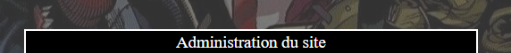
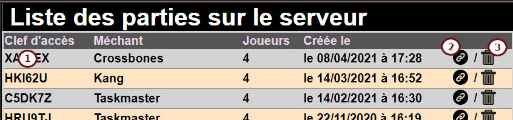
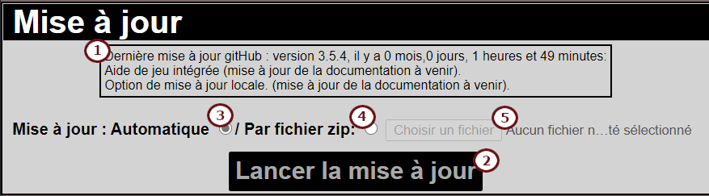

# Contenu de la documentation
### 1. [Installation de '*Remote Champions*'](https:#installation-de-remote-champions)
1a. [Prérequis](https:#prérequis)  
1b. [Séquence d'installation](https:#séquence-dinstallation)  
1c. [Mise à jour de '*Remote Champions*'](https:#mise-à-jour-de-remote-champions)  
### 2. [Utilisation de '*Remote Champions*'](https:#utilisation-de-remote-champions)
2a. [Page de connexion](https:#page-de-connexion)  
2b. [Création d'une partie](https:#création-dune-nouvelle-partie)  
2c. [Présentation de la page de partie](https:#présentation-de-la-page-de-partie)  
2d. [Paramètrage initial de la partie](https:#paramètrage-initial-de-la-partie)  
2e. [Gestion du méchant](https:#gestion-du-méchant)  
2f. [Gestion du joueur](https:#gestion-du-joueur)  
2g. [Gestion des Manigances](https:#gestion-des-manigances)  
### 3. [Administration du site](https:#administration-du-site)
3a. [Activation des boites de jeu](https:#activation-des-boites-de-jeu)  
3b. [Liste des parties sur le serveur](https:#liste-des-parties-sur-le-serveur)  
3c. [Mot de passe administratif](https:#mot-de-passe-administratif)  
3d. [Mode public](https:#mode-public)  
3e. [Mise à jour](https:#mise-à-jour)  
### 4. [Accès par smartphone](https:#accès-par-smartphone)
### 5. [Foire aux questions](https:#foire-aux-questions)

---
# Installation de '*Remote Champions*'
## Prérequis
Pour installer *Remote Champions* sur un serveur vous appartenant, il vous faudra quelques éléments indispensables : un [serveur web prenant en charge PHP](https:#serveur-web-php) et une [base de donnée type mySql](https:#base-de-données).
#### Serveur Web PHP
En complément de l'installation du service PHP, celui-ci (le compte avec lequel le service fonctionne) doit avoir les **accès en écriture et suppression sur le répertoire racine de l'installation** et sur tous les fichiers/dossiers inclus. Ces autorisations sont nécessaires pour mener à bien les processus d'installation et de mise à jour.  
De plus, le moteur php doit permettre les lectures de fichiers distants (http get) pour que l'installation et la mise à jour puissent se dérouler sans problème.  
Fonctionnement testé avec succès sur les configurations/versions suivantes :
 - Apache 2.4
 - PHP 7.2
#### Base de données
Il vous faut un service de base de donnée relationnelle type *mySql*.  
Fonctionnement testé avec succès sur les configuration/versions suivantes :
 - MariaDB 10
## Séquence d'installation
1. Copier tout le contenu (y compris le(s) sous-dossier(s)) du dossier **Setup** du présent dépot vers le dossier choisi sur votre serveur pour héberger le site *Remote Champions*.
1. Vérifier que votre installation de PHP a les droits nécessaires pour écrire et supprimer des fichiers dans le dossier choisi et ses sous-dossiers.
1. Il vous faut un identfiant pour vous connecter à votre serveur de base de données.
1. Si vous avez déja préparé une nouvelle base de données vierge sur votre serveur de base de donnée, vous pouvez passer directement à l'[étape 6](https:#setupLaunch)
1. Connectez-vous à votre interface de gestion mySQL afin de créer une nouvelle base de donnée. Vous pouvez également passer ce point en forunissant au processus d'installation les informations de connexion d'un utilisateur pouvant créer une base sur votre serveur.
1. Utiliser un navigateur Internet pour vous connecter à la racine de votre site web. (selon votre cas, vous taperez directement le nom de votre dossier ou vous devrez le faire suivre de "*/setup.php*".  

1. Dans l'écran d'installation qui vous est présenté renseignez les informations suivantes :
   - Nom/adresse du serveur mySql : vous pouvez utiliser *localhost* si le serveur de base de données est installé sur la même machine que le serveur web.
   - Numéro de port du serveur (3007 par défaut)
   - Nom de connexion au serveur : Nom de connexion de l'utilisateur de la base créée ou pouvant créer une base sur le serveur
   - Mot de passe de connexion au serveur : Mot de passe du précédent utilisateur
   - Nom de la base existante : Cochez ce choix si vous avez déjà créé une base mySQL et indiquez ici son nom
   - Nom de la base à créer : Cochez ce choix pour que le processus d'installation crée une nouvelle base de données sur le serveur
1. Si une nouvelle version du script d'installation est détectée, la page suivante apparaitra, cliquez simplement sur "Relancer la mise à jour".  

1. Ensuite, le processus d'installation va réellement débuter.L'écran de synthèse suivant vous indiquera toutes les étapes réalisées et leur résultat.  
1. A l'issue de l'installation, votre site devrait être fonctionnel!
1. cliquez sur "*Accéder au site*" pour l'utiliser... Vous pouvez désormais consulter la rubrique [Utilisation de votre site](https:#Utilisation-de-remote-champions) et vous serez prêt à joueur dans un instant !  
**Note :** Si vous utilisez le site pour jouer à distance avec des amis (but original de ce développement), il faudra bien sur que le site web soit accèssible de tous les joueurs sur Internet.
## Mise à jour de '*Remote Champions*'
Lorsque le site est installé, vous pouvez vérifier les mises à jours récentes en utilisant le bouton dans l'écran d'administration ou en accèdant à la page "*/setup.php*".  
 *(En construction)* 

---
# Utilisation de '*Remote Champions*'
**Préambule:** L'outil *Remote Champions* n'est en aucun cas prévu pour remplacer la possession des cartes par les joueurs : il  apour seul objectif de fluidifier le déroulement des parties (particulièrement des parties jouée à distance, avec audio/visio conférence) en tenant à jour un maximum des éléments nécessaires au suvi de la partie et en les présentant aux différents joueurs.  
## Page de connexion
Utilisez votre navigateur Internet, depuis votre ordinateur ou depuis votre smartphone pour accéder à votre installation de *Remote Champions*. La page d'accueil se présente comme l'illustration suivante:  

- Si la partie qui vous intéresse a déjà été créée, vous pouvez simplement saisir **son mot-clef** dans le premier champ avant de cliquer sur "*OK*",
- En cliquant sur le bouton "**Créer**" (non disponible sur smartphone), vous basculez sur la page de [création d'une nouvelle partie](https:#Création-dune-nouvelle-partie)(a noter qu'un mot de passe peut être demandé si la fonction de serveur public a été activé dans l'écran d'administration décrit plus loin),
- En dehors des écrans d'administration et d'installation/mise à jour, en cliquant sur la barre d'administration (non disponible sur smartphone) vous serez dirigé vers l'écran d'administration, [décrit plus loin](https:#administration-du-site) (A noter, un mot de passe administratif sera nécessaire pour se connecter sur ces pages sensibles, le mot de passe par défaut après installation est **admin**),
- Dans tous les écrans du site, en cliquant sur le bouton d'Informations (non disponible sur smartphone), vous serez directelent dirigé sur la présente aide d'utilisation,
- Dans tous les écrans du site, en cliquant sur le bouton de rapport de bug (non disponible sur smartphone), vous serez directement dirigé sur *gitHub* afin de saisir une description du problème que vous rencontrez (Un compte gratuit *gitHub* sera nécessaire. Merci pour vos retours!).
## Création d'une nouvelle partie
La page de création d'une nouvelle partie ressemblera à l'illustration ci-dessous:  
  
- Pour créer une nouvelle partie, vous pouvez choisir le nombre de joueurs (1 à 4) depuis le menu.  
- **À noter :** vous pouvez également créer une partie ayant pour seul objectif de suivre les information d'un méchant en cliquant sur la case "*Méchant seul*". cela peut, par exemple, être utile pour créer plusieurs parties et suivre plusieurs méchants, dans une partie avec *Kang*.  
- Une clef d'accès par défaut est automatiquement affectée à la partie que vous allez créer. Si vous le souhaitez, vous pouvez modifier la valeur de cette clef proposée dans le champ "*Clef d'accès*" (A noter: les clefs d'accès doivent impérativement comporter 6 caractères et être uniques).  
- Une fois ces informations essentielles saisies, vous pouvez cliquer sur "*Créer*" pour lancer la création de la partie.
### Options
Vous pouvez (cela n'est pas une obligation, mais peut permettre de simplifier la sélection des manigances pendant la partie) également choisir les decks qui seront utilisé pendant votre partie.  
Pour ce faire, il vous suffit de cliquer sur la case à cocher en regard d'un deck pour le sélectionner ou le déselectionner avant de cliquer sur le bouton "*Créer*".  
 - Les decks pouvant être selectionnés sont regroupés par boite de jeu/extensions/paquets pour les retrouver plus facilement. Les boites disponibles sont celles déclarée comme telles dans l'[administration du site](https:#activation-des-boites-de-jeu).
 - Vous pouvez (dé)sélectionner tous les decks en un click pour plus de failité.
Après que vous avez créé votre nouvelle partie, vous serez dirigé vers la page de celle-ci (ou vers votre fiche de joueur si vous êtes sur smartphone).  

Si une erreur empèche la création de la partie, elle vous sera communiquer sur la même page, afin que vous puissiez retenter la création.
## Présentation de la page de partie
La page principale d'une partie qui vient d'être créée ressemble à l'illustration suivante:  
  
Cette page est divisée en différentes zones:  
La fiche de joueur, qui représente l'état de chaque joueur (elle est détaillée [plus loin](https:#Gestiondujoueur)).  
La synthèse du méchant qui fournit les informations sur la situation actuelle du méchant de la partie (elle est détaillée [plus loin](https#Gestionduméchant))  
L'indicateur du premier joueur. Le premier joueur est désigné au hasard parmi les joueurs de la partie lors de la sélection de la manigance principale. Il suffira ensuite de cliquer sur l'indicateur du premier joueur pour indiquer que c'est le tour du joueur suivant (l'indicateur se déplace).  
Un ensemble de compteurs annexes. A vous de voir si vous avez besoin d'autres compteurs que les principaux prévus : ce pourra servir pour suivre des éléments spécifiques de certaines missions...  
La gestion des manigances (détaillée [plus loin](https#GestiondesManigances)).  
A tout moment, le **mot-clef d'accès** à la partie, à communiquer à tous les joueurs pour que ceux-ci puissent la rejoindre est rappelé en bas de page. (nota : Non disponible sur smartphone; En cliquant dessus, il est possible d'ouvrir l'[écran d'administration](https:#administration-du-site) décrit plus loin).  
## Paramètrage initial de la partie
  
1. Il est conseillé de commencer par attribuer les places aux joueurs:
  - Mettez-vous d'accord avec tous les joueurs (y compris distants) pour trouver une disposition ayant le plus de sens pour l'ensemble des joueurs de la partie.
  - Cliquez sur le nom de chaque joueur. Cela fait appraitre la fenêtre de changement de nom de joueur : saisissez le nouveau nom/surnon du joueur et validez.
  - Cliquez sur l'image de héros de l'emplacement de joueur pour faire apparaître la fenêtre de sélection de héros.
  - Seléctionnez le héros qui sera joué par le joueur en question (la liste des héros présentés dépend des boites/packs déclarés disponibles dans l'[administration du site](https:#activation-des-boites-de-jeu)).
  - La vie maximum du joueur est affectée automatiquement.
2. Ensuite, choisissez le méchant qui sera combattu pendant la partie:
  - Cliquez sur l'image de méchant neutre. (Vous pourrez changer de méchant à tout moment en cliquant de nouveau sur son image).
  - La fenêtre de sélection de méchant apparait. Cliquez sur le méchant choisi pour la partie (la liste des méchants présentés dépend des boites/packs déclarés disponibles dans l'[administration du site](https:#activation-des-boites-de-jeu))
  - Une fois le méchant choisi, la fenêtre de sélection de la manigance principale apparait. Sélectionnez la manigance principale dans le menu (la liste présentée dépend des boites/packs déclarés disponibles dans l'[administration du site](https:#activation-des-boites-de-jeu)) et confirmez. (si vous annulez ou souhaitez changer la manigance principale, cliquez sur son titre).
  - Après la sélection de la manigance principale, l'indicateur de premier joueur est attribué au hasard, vous pouvez utiliser cette fonction pour décider qui jouera en premier pour débuter la partie.
  - Si vous jouez une partie dans laquelle le méchant ne commence par à la phase I, cliquez sur l'indication de phase pour passer à la phase suivante dès le début de partie.
  - La vie du méchant est initialisée, en fonction du nombre de joueurs (Ajustez là si vous utilisez *Remote Champions* pour suivre uniquement la vie du méchant).

**Conseil :** Mettez-vous d'accord avec tous les joueurs pour affecter la responsabilité des diverses mises à jour. Sinon, comme tous les joueurs peuvent éditer la page de la partie en cours, vous risquez d'avoir des modifications multiples.  

En cours de partie, selon l'évolution de celle-ci, la page de partie ressemblera à quelque-chose comme l'illustration suivante:  
  
 *(En construction)* 
## Gestion du méchant

 *(En construction)* 
## Gestion du joueur

 *(En construction)* 
## Gestion des Manigances

 *(En construction)* 

---
# Administration du site
Dans la plupart des écrans de *Remote Champions*, vous trouverez la barre d'administration (non disponible sur smartphone) illustrée ci-dessous.  
  
En cliquant dessus, il vous sera demandé d'indiquer le mot de passe administratif (le mot de passe par défaut après installation du site est "**admin**"). Si vous renseignez le bon ot de passe, vous serez redirigé vers la page d'administration, divisée en plusieurs sections dont la déscription suit.
## Activation des boites de jeu
  
 *(En construction)* 
## Liste des parties sur le serveur
  
 *(En construction)* 
## Mot de passe administratif
  
 *(En construction)* 
## Mode public
Si le seveur est plus largement accessible, vous souhaiterez peut-être limiter la possibilité de création de nouvelles parties.  
C'est ce qui s'appelle le *Mode Public*. Celui-ci est désactivé par défaut et n'importe qui connaissant l'adresse du serveur pourra y créer autant de nouvelles parties qu'il/elle souhaite.
Si vous souhaitez activer le *Mode Public*, il faudra également fournir un mot de passe (dont seule une empreinte est stockée sur le serveur). Une fois ce paramètre validé, ledit mot de passe sera demandé pour accéder à la page de création de nouvelle partie.  
 *(En construction)* 
## Mise à jour
  
 *(En construction)* 
# Accès par smartphone
# Foire aux questions
**A quoi correspond l'icône du *Shield* qui apparait fugacement ?**  
Le contenu du sit est dynamique, cette icône s'affiche lorsqu'une page télécharge de nouveaux éléments pour se mettre à jour.  
Dans le même ordre d'idée, une icône de disquette s'affiche lorsque vous faites un changement sur une page. Si elle ne disparait pas, cela suggère que la modification n'a pas été prise en compte par le serveur (il pourra être alors prudent de rafraichir la page).
